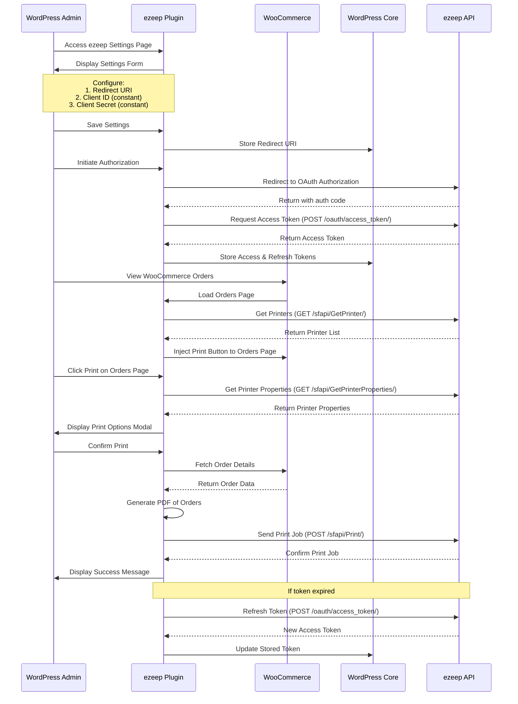

# ezeep's Order Printing for WooCommerce Plugin

ezeep's Order Printing for WooCommerce Plugin extends the WooCommerce functionality to send print jobs from WooCommerce orders to the printers added with the ezeep account.

## Diagram



## Endpoints

1. OAuth Token Endpoint:
   URL: `https://account.ezeep.com/oauth/access_token/`
   Method: POST
   Parameters:
   - grant_type: 'authorization_code' or 'refresh_token'
   - scope: 'printing'
   - code: (when grant_type is 'authorization_code')
   - redirect_uri: (when grant_type is 'authorization_code')
   - refresh_token: (when grant_type is 'refresh_token')
   Headers:
   - Authorization: Basic [base64 encoded client_id:client_secret]

2. Get Printers Endpoint:
   URL: `https://printapi.ezeep.com/sfapi/GetPrinter/`
   Method: GET
   Headers:
   - Authorization: Bearer [access_token]

3. Get Printer Properties Endpoint:
   URL: `https://printapi.ezeep.com/sfapi/GetPrinterProperties/?id=[printer_id]`
   Method: GET
   Headers:
   - Authorization: Bearer [access_token]

4. Print Endpoint:
   URL: `https://printapi.ezeep.com/sfapi/Print/`
   Method: POST
   Headers:
   - Content-Type: application/json
   - Authorization: Bearer [access_token]
   Body (JSON):
   - fileurl: URL of the file to print
   - type: 'pdf'
   - printerid: ID of the printer to use
   - properties: Object containing print properties like paper, color, duplex, orientation, copies, resolution

5. OAuth Authorization Endpoint (used in frontend, not directly called in backend):
   URL: `https://account.ezeep.com/oauth/authorize/`
   Method: GET (via redirect)
   Parameters:
   - response_type: 'code'
   - client_id: [your_client_id]
   - redirect_uri: [your_redirect_uri]

## Development Environment Setup

This project uses Docker for local development. Here's how to set it up:

1. Ensure you have Docker and Docker Compose installed on your system.
2. Clone this repository to your local machine.
3. Navigate to the project directory in your terminal.

### Docker Setup

The project includes the following Docker configuration:

- `Dockerfile`: Builds a custom WordPress image with WP-CLI and other necessary tools.
- `docker-compose.yml`: Defines the services (WordPress, MySQL, Adminer) needed for the development environment.
- `init-wordpress.sh`: Initializes WordPress and installs WooCommerce.

To start the development environment:

```bash
docker-compose down
docker-compose up --build
```

This will start WordPress at `http://localhost:8000/wp-admin/plugins.php` and Adminer at `http://localhost:8080`.

## Installation

For production use:

1. Upload the ezeep Order Printing Extension for WooCommerce folder to the /wp-content/plugins/ directory or install it directly from the WordPress plugin repository.
2. Activate the plugin through the 'Plugins' menu in WordPress.
3. Go to the plugin settings page under ezeep menu in the left menu bar in your WordPress admin dashboard to configure your ezeep integration.

## Configuration

1. Navigate to the ezeep settings page in your WordPress admin dashboard.
2. Enter your ezeep credentials to authorize the site to send print requests to the printers added to the ezeep account.
3. After successful authorization, you will be able to see a dropdown of ezeep organizations. Select your preferred organization.

## Required Constants for wp-config.php

Add the following constants to your `wp-config.php` file:

```php
// ezeep API Credentials
define('EZEEP_CLIENT_ID', 'your_ezeep_client_id_here');
define('EZEEP_CLIENT_SECRET', 'your_ezeep_client_secret_here');

// WordPress Debug Settings (recommended for development)
define('WP_DEBUG', true);
define('WP_DEBUG_LOG', true);
define('WP_DEBUG_DISPLAY', false);
```

Replace `'your_ezeep_client_id_here'` and `'your_ezeep_client_secret_here'` with your actual ezeep API credentials.

**Note:** The EZEEP_CLIENT_ID and EZEEP_CLIENT_SECRET should be kept confidential and not shared publicly. For development purposes, you may use a shared set of credentials, but ensure they are not committed to version control.

## How to Use

1. Go to the WordPress admin area and navigate to the 'Orders' section.
2. On the orders listing page, you will find a dropdown menu listing all available printers along with an 'Export' button.
3. Select a printer from the dropdown menu.
4. Click the 'Export' button to open a popup displaying the selected printer's properties.
5. Choose your preferred properties.
6. Click the 'Print' button to release the print job.

## Development

The plugin code is mounted as a volume in the Docker setup, allowing you to make changes to the plugin code and see them reflected immediately in the running WordPress instance.

## Debugging

WordPress debugging is enabled in the provided `wp-config.php`. Debug logs will be written to the default location within the WordPress container.

## Support

For any issues or questions, please contact our support team at <helpdesk@ezeep.com>.

## Contributing

We welcome contributions from the community. If you find any bugs or have suggestions for improvements, please create an issue or submit a pull request.

## License

This plugin is licensed under the MIT License - see the LICENSE file for details.
